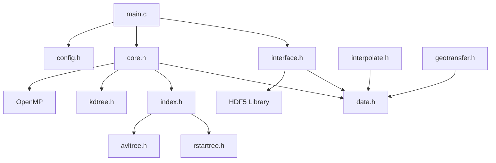

# FY-3G空间重采样工具 - 代码说明文档(AIGC辅助生成)

## 目录
- [1. 项目架构概览](#1-项目架构概览)
- [2. 核心模块详解](#2-核心模块详解)
- [3. 数据结构设计](#3-数据结构设计)
- [4. 算法实现原理](#4-算法实现原理)
- [5. API接口说明](#5-api接口说明)
- [6. 构建系统说明](#6-构建系统说明)
- [7. 测试框架](#7-测试框架)

## 1. 项目架构概览

### 1.1 整体架构
项目采用分层模块化架构设计，主要分为以下层次：

```
┌─────────────────────────────┐
│        Application Layer    │  <- main.c
├─────────────────────────────┤
│        Interface Layer      │  <- interface.h/c
├─────────────────────────────┤
│        Core Processing      │  <- core.h/c
├─────────────────────────────┤
│    Algorithm & Data Struct  │  <- interpolate, geotransfer
├─────────────────────────────┤
│      Spatial Index Layer    │  <- rstartree, kdtree, avltree
├─────────────────────────────┤
│         Data Layer          │  <- data.h, config.h
└─────────────────────────────┘
```

### 1.2 模块依赖关系


## 2. 核心模块详解

### 2.1 主程序模块 (main.c)

#### 功能概述
主程序负责整个数据处理流程的协调和控制。

#### 处理流程
```c
int main(int argc, char *argv[]) {
    // 1. 配置文件读取
    g_config = ReadConfig(argv[1]);
    
    // 2. 双波段数据处理循环
    for (unsigned int bandIndex = 0; bandIndex < 2; bandIndex++) {
        // 2.1 读取HDF5数据
        HDFDataset dataset;
        ReadHDF5(bandIndex, g_config->input_file_name, &dataset);
        
        // 2.2 数据预处理和坐标转换
        GeodeticGrid processedGrid;
        PointBatch* pointBatch = CreateRStarPointBatch(capacity);
        ProcessDataset(&dataset, &processedGrid, pointBatch);
        
        // 2.3 初始化空间索引和裁剪网格
        IndexForest forest;
        ClipGridResult finalGrid;
        InitClipResult(&dataset, &processedGrid, pointBatch, &forest, &finalGrid);
        
        // 2.4 空间插值处理
        InterpolateGrid(&processedGrid, &forest, &finalGrid);
        
        // 2.5 结果输出
        WriteClipResult(bandIndex, g_config->clip_output_file_name, &finalGrid);
        
        // 2.6 资源清理
        DestroyHDFDataset(&dataset);
        DestroyRStarPointBatch(pointBatch);
        DestroyGeodeticGrid(&processedGrid);
        DestroyIndexForest(&forest);
        DestroyClipGridResult(&finalGrid);
    }
    return 0;
}
```

#### 错误处理机制
- 返回值编码：-1~-5分别对应不同的错误阶段
- 内存管理：确保所有分配的资源在异常情况下正确释放

### 2.2 接口层模块 (interface.h/c)

#### 功能概述
负责HDF5文件的读写操作和数据格式转换。

#### 主要接口

##### 2.2.1 HDF5读取接口
```c
bool ReadHDF5(const unsigned int bandIndex, const char* filename, HDFDataset* dataset);
```
- **功能**：读取指定波段的HDF5数据文件
- **参数**：
  - `bandIndex`: 波段索引（0或1）
  - `filename`: 输入文件路径
  - `dataset`: 输出数据结构指针
- **返回值**：读取成功返回true，失败返回false

##### 2.2.2 全局属性读取
```c
bool ReadGlobalAttribute(hid_t fileID, HDFGlobalAttribute* globalAttribute);
```
- **功能**：读取HDF5文件的全局属性信息
- **包含信息**：扫描线数量、开始/结束时间、升降轨标识

##### 2.2.3 批处理读取接口
```c
bool ReadBatchScanLines(hsize_t startLine, hsize_t batchSize, 
                       const HDFBandRequired* required, 
                       BatchReadContext* ctx, GridInfo** infoArray);
```
- **功能**：批量读取扫描线数据，优化内存使用
- **特点**：支持大文件的分批处理，减少内存占用

### 2.3 核心处理模块 (core.h/c)

#### 功能概述
实现数据处理的核心算法，包括坐标转换、网格生成和插值处理。

#### 主要函数

##### 2.3.1 数据集处理
```c
bool ProcessDataset(const HDFDataset* dataset, GeodeticGrid* geodeticGrid, PointBatch* pointBatch);
```
- **处理步骤**：
  1. 并行处理每条扫描线
  2. 对每个角度和高度进行坐标转换
  3. 构建空间点集合
  4. 生成大地坐标网格

##### 2.3.2 网格插值
```c
bool InterpolateGrid(const GeodeticGrid* processedGrid, IndexForest* forest, ClipGridResult* finalGrid);
```
- **插值策略**：
  1. 使用R*树进行空间邻域搜索
  2. 应用K近邻插值算法
  3. 考虑距离权重和高度层次

### 2.4 地理转换模块 (geotransfer.h/c)

#### 功能概述
实现扫描坐标系到大地坐标系的转换算法。

#### 核心算法
坐标转换基于球面几何学原理，考虑以下因素：
- 地球椭球体模型（WGS84）
- 卫星轨道参数
- 雷达扫描几何
- 大气折射修正

### 2.5 空间插值模块 (interpolate.h/c)

#### 功能概述
实现空间数据的插值算法，支持多种插值方法。

#### 插值算法
1. **K近邻插值**：基于距离权重的加权平均
2. **反距离权重法**：考虑空间相关性的插值
3. **高度加权**：针对垂直分布的特殊处理

## 3. 数据结构设计

### 3.1 核心数据结构

#### 3.1.1 GridInfo结构
```c
typedef struct {
    float groundL, groundB, groundH;        // 地面经纬度和高度
    float airL, airB, zeta;                 // 空中位置和天顶角
    float evaluation, clutterFreeBottomIndex; // 评估值和杂波底部索引
    float *heightArray, *measuredArray;     // 高度数组和测量值数组
} GridInfo;
```

#### 3.1.2 HDFDataset结构
```c
typedef struct {    
    GridInfo** infoArray;                   // 扫描数据数组
    HDFGlobalAttribute globalAttribute;     // 全局属性
} HDFDataset;
```

#### 3.1.3 GeodeticGrid结构
用于存储转换后的大地坐标网格数据，支持高效的空间查询和插值操作。

### 3.2 空间索引数据结构

#### 3.2.1 R*树结构 (rstartree.h/c)
- **用途**：高效的空间范围查询
- **特点**：支持多维空间索引，优化磁盘I/O
- **应用**：邻域搜索和范围查询

#### 3.2.2 KD树结构 (kdtree.h/c)
- **用途**：K近邻搜索
- **特点**：二进制空间分割，平衡树结构
- **应用**：最近邻查询

## 4. 构建系统说明

### 4.1 CMake配置

#### 主要配置项
```cmake
# C标准设置
set(CMAKE_C_STANDARD 11)

# 编译器优化选项
set(CMAKE_C_FLAGS_RELEASE "-O3 -Wall -march=native")

# OpenMP支持
find_package(OpenMP REQUIRED)
target_link_libraries(FY3G_Resampling_exe OpenMP::OpenMP_C)

# HDF5自动构建
ExternalProject_Add(hdf5 ...)
```

#### 目标配置
- `FY3G_Resampling`: 共享库
- `FY3G_Resampling_exe`: 可执行文件
- `FY3G_Resampling_test`: 测试程序

### 4.2 依赖管理

#### 外部依赖
- **HDF5**: 通过ExternalProject自动下载编译
- **libspatialindex**: 子模块形式包含
- **OpenMP**: 系统查找

#### 编译选项
```cmake
# 调试版本
-DCMAKE_BUILD_TYPE=Debug

# 发布版本
-DCMAKE_BUILD_TYPE=Release
```
